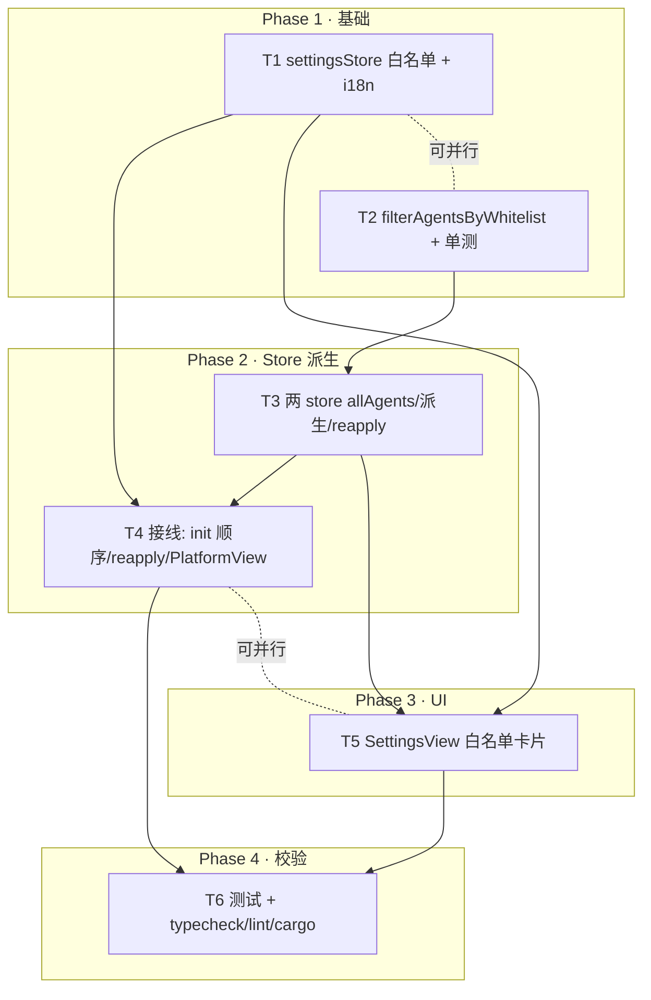

# Dependency Graph

```mermaid
graph TD
    subgraph P1["Phase 1 · 基础"]
        T1[T1 settingsStore 白名单 + i18n]
        T2[T2 filterAgentsByWhitelist + 单测]
    end
    subgraph P2["Phase 2 · Store 派生"]
        T3[T3 两 store allAgents/派生/reapply]
        T4[T4 接线: init 顺序/reapply/PlatformView]
    end
    subgraph P3["Phase 3 · UI"]
        T5[T5 SettingsView 白名单卡片]
    end
    subgraph P4["Phase 4 · 校验"]
        T6[T6 测试 + typecheck/lint/cargo]
    end

    T2 --> T3
    T1 --> T4
    T3 --> T4
    T1 --> T5
    T3 --> T5
    T4 --> T6
    T5 --> T6

    T1 -. 可并行 .- T2
    T4 -. 可并行 .- T5
```

## 并行车道说明
- T1 ∥ T2：无依赖、不同文件
- T4 ∥ T5：均依赖 T1+T3，但改不同文件（App.tsx/PlatformView.tsx vs SettingsView.tsx），合并风险低
